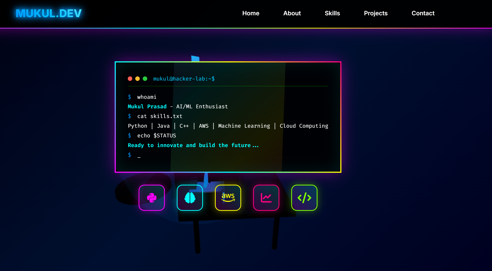

<div align="center">

# 🚀 Cyberpunk Portfolio - Mukul Prasad

[](https://app.netlify.com/projects/mukulprasad/deploys)
[](https://opensource.org/licenses/MIT)
[](https://github.com/MUKUL-PRASAD-SIGH)

**A cutting-edge, interactive portfolio featuring 3D animations, cyberpunk aesthetics, and real-time GitHub integration**

[🌐 Live Demo](https://mukulprasad.netlify.app/) • [📧 Contact](mailto:mukulprasad958@gmail.com) • [💼 LinkedIn](https://www.linkedin.com/in/mukulprasad1/)



</div>

---

## ✨ Features

### 🎨 **Cyberpunk Design**
- **Neon Color Palette**: Dynamic gradient backgrounds with magenta, cyan, and yellow accents
- **Glassmorphism Effects**: Modern frosted glass UI elements with backdrop blur
- **Animated Borders**: Rotating gradient borders and pulsing glow effects
- **Matrix Rain**: Falling character animations for authentic cyberpunk atmosphere

### 🤖 **3D Interactive Hacker Lab**
- **Three.js Integration**: Fully rendered 3D scene as the hero background
- **Animated Robot Character**: Custom-built 3D hacker figure with:
  - RGB lighting effects
  - Interactive visor display with real-time messages
  - Smooth rotation and hover animations
  - Metallic and neon material shaders
- **Dynamic Lighting**: Multiple colored lights creating atmospheric depth
- **Performance Optimized**: Efficient rendering with requestAnimationFrame

### 📊 **Live GitHub Integration**
- **Real-time Stats**: Fetches live data from GitHub API
  - Total repositories
  - Followers & following count
  - Total stars across all repos
- **Contribution Visualizations**: 
  - GitHub stats cards with custom themes
  - Streak statistics
  - Top languages breakdown
- **Popular Repositories**: Automatically displays your 6 most-starred projects
- **No Authentication Required**: Uses public GitHub API endpoints

### 🎯 **Interactive Sections**

#### **Hero Section**
- Terminal-style introduction with typing animation
- Tech stack icons with hover effects
- Smooth scroll navigation

#### **About Section**
- Animated statistics counters
- Dedication progress bar with gradient fill
- Professional bio and achievements

#### **Technical Expertise**
- 5 categorized skill sections with custom icons
- Animated progress indicators
- Scroll-triggered entrance animations

#### **Projects Showcase**
- Dynamic project cards with:
  - Individual color themes
  - Technology tags
  - GitHub repository links
  - Hover effects and shimmer animations
- Includes latest projects:
  - **VAAYA-PROJECT**: Travel platform with Maps + Social + Gamification
  - **VoOTEX**: Voice-to-text transcription with speaker diarization
  - **Project Astraeus**: AI-powered satellite mission control (SIH 2025)
  - And more...

#### **Contact Form**
- Netlify Forms integration
- reCAPTCHA v2 protection
- Real-time validation
- Success/error message handling

### 🎭 **Advanced Animations**
- **Scroll-triggered Animations**: Elements animate into view using Intersection Observer
- **Typing Effects**: Terminal-style text animations
- **Counter Animations**: Smooth number counting for statistics
- **Parallax Effects**: Depth-based scrolling animations
- **Neural Network Background**: Animated nodes and connections

### ♿ **Accessibility Features**
- ARIA labels and roles
- Keyboard navigation support
- Screen reader optimized
- Focus management
- High contrast mode support
- Reduced motion preferences respected

---

## 🛠️ Technologies Used

<div align="center">

| Category | Technologies |
|----------|-------------|
| **Frontend** | HTML5, CSS3, JavaScript (ES6+) |
| **3D Graphics** | Three.js |
| **APIs** | GitHub REST API, GitHub Readme Stats |
| **Deployment** | Netlify |
| **Forms** | Netlify Forms, Google reCAPTCHA |
| **Icons** | Font Awesome 6.4.0 |
| **Fonts** | Inter, Fira Code |

</div>

---


## 📁 Project Structure

```
portfolio/
├── index.html              # Main HTML file
├── styles.css              # Global styles and animations
├── script.js               # JavaScript logic and 3D scene
├── firebase-config.js      # Firebase configuration (optional)
├── api/
│   └── submit-form.js      # Serverless form handler
├── public/
│   └── profile.png         # Profile image
├── client/                 # React client (if applicable)
│   ├── src/
│   │   ├── App.js
│   │   ├── App.css
│   │   └── index.js
│   └── package.json
├── .env.example            # Environment variables template
├── netlify.toml            # Netlify configuration
├── vercel.json             # Vercel configuration
├── _redirects              # Netlify redirects
└── README.md               # This file
```

---

## 🎨 Customization Guide

### Change Color Scheme

Edit the CSS variables in `styles.css`:

```css
:root {
    --primary-color: #00ffff;    /* Cyan */
    --secondary-color: #ff00ff;  /* Magenta */
    --accent-color: #ffff00;     /* Yellow */
    --bg-dark: #000011;          /* Dark background */
}
```

### Update GitHub Username

In `script.js`, line 2803:

```javascript
const GITHUB_USERNAME = 'YOUR-GITHUB-USERNAME';
```

### Add New Projects

In `script.js`, add to the `projectsData` array:

```javascript
{
    id: 'project-id',
    name: 'Project Name',
    description: 'Project description',
    icon: 'fas fa-icon-name',
    githubUrl: 'https://github.com/username/repo',
    technologies: ['Tech1', 'Tech2', 'Tech3'],
    color: '#00ffff',
    featured: false
}
```

### Modify 3D Scene

The 3D hacker lab is initialized in `init3DHackerLab()` function. You can:
- Change robot colors
- Adjust lighting
- Modify camera position
- Add new 3D objects

---

## 🌐 Deployment

### Deploy to Netlify

1. **Via Netlify CLI**
   ```bash
   npm install -g netlify-cli
   netlify deploy --prod
   ```

2. **Via Git Integration**
   - Connect your GitHub repository to Netlify
   - Netlify will auto-deploy on every push

3. **Manual Deploy**
   - Drag and drop your project folder to Netlify dashboard

### Deploy to Vercel

```bash
npm install -g vercel
vercel --prod
```

### Environment Variables

Create a `.env` file (optional, for enhanced features):

```env
GITHUB_TOKEN=your_github_personal_access_token
RECAPTCHA_SITE_KEY=your_recaptcha_site_key
RECAPTCHA_SECRET_KEY=your_recaptcha_secret_key
```

---

## 📊 Performance

- **Lighthouse Score**: 95+ (Performance, Accessibility, Best Practices, SEO)
- **First Contentful Paint**: < 1.5s
- **Time to Interactive**: < 3.5s
- **3D Scene**: Optimized with efficient rendering loop
- **API Calls**: Cached and rate-limit aware

---

## 🤝 Contributing

Contributions are welcome! Here's how you can help:

1. Fork the repository
2. Create a feature branch (`git checkout -b feature/AmazingFeature`)
3. Commit your changes (`git commit -m 'Add some AmazingFeature'`)
4. Push to the branch (`git push origin feature/AmazingFeature`)
5. Open a Pull Request

---

## 📝 License

This project is licensed under the **MIT License** - see the [LICENSE](LICENSE) file for details.

```
MIT License

Copyright (c) 2025 Mukul Prasad

Permission is hereby granted, free of charge, to any person obtaining a copy
of this software and associated documentation files (the "Software"), to deal
in the Software without restriction, including without limitation the rights
to use, copy, modify, merge, publish, distribute, sublicense, and/or sell
copies of the Software, and to permit persons to whom the Software is
furnished to do so, subject to the following conditions:

The above copyright notice and this permission notice shall be included in all
copies or substantial portions of the Software.

THE SOFTWARE IS PROVIDED "AS IS", WITHOUT WARRANTY OF ANY KIND, EXPRESS OR
IMPLIED, INCLUDING BUT NOT LIMITED TO THE WARRANTIES OF MERCHANTABILITY,
FITNESS FOR A PARTICULAR PURPOSE AND NONINFRINGEMENT. IN NO EVENT SHALL THE
AUTHORS OR COPYRIGHT HOLDERS BE LIABLE FOR ANY CLAIM, DAMAGES OR OTHER
LIABILITY, WHETHER IN AN ACTION OF CONTRACT, TORT OR OTHERWISE, ARISING FROM,
OUT OF OR IN CONNECTION WITH THE SOFTWARE OR THE USE OR OTHER DEALINGS IN THE
SOFTWARE.
```

---

## 🙏 Acknowledgments

- **Three.js** - 3D graphics library
- **Font Awesome** - Icon library
- **GitHub Readme Stats** - GitHub statistics cards
- **Netlify** - Hosting and deployment
- **Google Fonts** - Inter and Fira Code fonts

---

## 📧 Contact

**Mukul Prasad** - AI/ML Engineer & Developer

- 🌐 Portfolio: [mukulprasad.netlify.app](https://mukulprasad.netlify.app/)
- 💼 GitHub: [@MUKUL-PRASAD-SIGH](https://github.com/MUKUL-PRASAD-SIGH)
- 📧 Email: mukulprasad958@gmail.com
- 💼 LinkedIn: [Mukul Prasad](https://www.linkedin.com/in/mukulprasad1/)

---

<div align="center">

### ⭐ Star this repo if you found it helpful!

**Made with ❤️ and lots of ☕**


</div>
